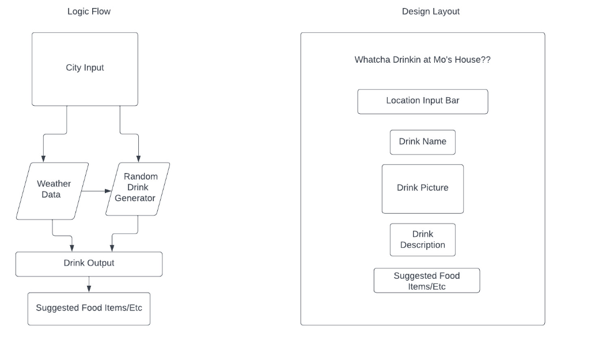

# Mo's House Weather App

## Description
An application that takes in weather data from whatever city you are in and suggests a drink from the Mo's House menu.
Imagining Mo's House as an international chain with the same charm as a local cocktail bar.

### Example

- Enter: New York 
- Output: Mo's House cocktail that is best suited for current climate.

#### Wireframe

###### Technologies Used: 
- HTML 
- JavaScript
- CSS
- JQuery
- Google Fonts

###### Links Used
- [Mo's House Menu](https://www.mos-house.com/menus)
- [Trello Workflow](https://trello.com/b/Ah3ii4UE/unit-1-project)
- [Lucid Wireframe](https://lucid.app/lucidchart/f2c34f3d-6ba0-4e00-a976-2176f215a507/edit?viewport_loc=-208%2C-137%2C1912%2C948%2C0_0&invitationId=inv_2c0492e5-fbb0-41bb-9fe3-91bf8abba24b)
- [Weather API](https://openweathermap.org/api)
